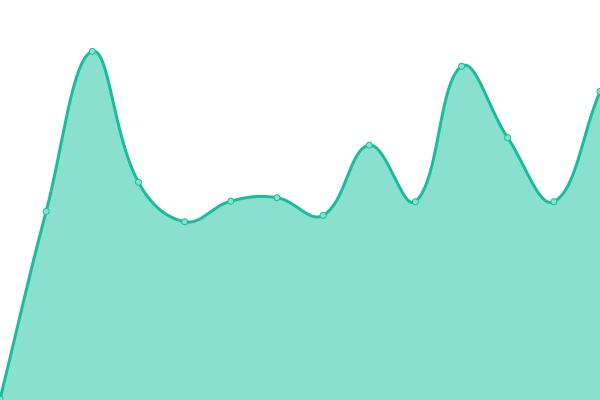
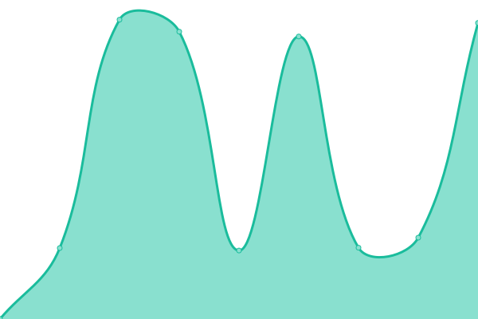

# [📈 Live Status](https://syvtec.github.io/guardian): <!--live status--> **🟧 Partial outage**

This repository contains the open-source uptime monitor and status page for [Deep Pandas](https://syvtec.github.io/guardian), powered by [Upptime](https://github.com/upptime/upptime).

With [Upptime](https://upptime.js.org), you can get your own unlimited and free uptime monitor and status page, powered entirely by a GitHub repository. We use [Issues](https://github.com/syvtec/guardian/issues) as incident reports, [Actions](https://github.com/syvtec/guardian/actions) as uptime monitors, and [Pages](https://syvtec.github.io/guardian) for the status page.

<!--start: status pages-->
<!-- This summary is generated by Upptime (https://github.com/upptime/upptime) -->
<!-- Do not edit this manually, your changes will be overwritten -->
<!-- prettier-ignore -->
| URL | Status | History | Response Time | Uptime |
| --- | ------ | ------- | ------------- | ------ |
|  [Deep Website](https://deepofficegroup.com) | 🟩 Up | [deep-website.yml](https://github.com/syvtec/guardian/commits/HEAD/history/deep-website.yml) | 

 378ms
     
 | 

<a href="https://syvtec.github.io/guardian/history/deep-website">99.77%</a>
    

|  [Deep Invoices](https://services.deepofficehub.com) | 🟩 Up | [deep-invoices.yml](https://github.com/syvtec/guardian/commits/HEAD/history/deep-invoices.yml) | 

 1134ms
     
 | 

<a href="https://syvtec.github.io/guardian/history/deep-invoices">100.00%</a>
    

|  [Deep Pro](https://deepofficepro.com) | 🟩 Up | [deep-pro.yml](https://github.com/syvtec/guardian/commits/HEAD/history/deep-pro.yml) | 

 1136ms
     
 | 

<a href="https://syvtec.github.io/guardian/history/deep-pro">100.00%</a>
    

|  [PrimeCC](https://deepofficehub.com) | 🟩 Up | [prime-cc.yml](https://github.com/syvtec/guardian/commits/HEAD/history/prime-cc.yml) | 

 3603ms
     
 | 

<a href="https://syvtec.github.io/guardian/history/prime-cc">100.00%</a>
    

|  [Overflow CFM](https://cfm.deepofficehub.com) | 🟩 Up | [overflow-cfm.yml](https://github.com/syvtec/guardian/commits/HEAD/history/overflow-cfm.yml) | 

 2231ms
     
 | 

<a href="https://syvtec.github.io/guardian/history/overflow-cfm">100.00%</a>
    

|  [Assets Mgt](https://assets.deepofficehub.com) | 🟩 Up | [assets-mgt.yml](https://github.com/syvtec/guardian/commits/HEAD/history/assets-mgt.yml) | 

 985ms
     
 | 

<a href="https://syvtec.github.io/guardian/history/assets-mgt">100.00%</a>
    

|  [Velocity](https://velocity.deepofficehub.com) | 🟥 Down | [velocity.yml](https://github.com/syvtec/guardian/commits/HEAD/history/velocity.yml) | 

 967ms
     
 | 

<a href="https://syvtec.github.io/guardian/history/velocity">100.00%</a>
    

|  [Inheritance](https://inheritanceintl.com) | 🟩 Up | [inheritance.yml](https://github.com/syvtec/guardian/commits/HEAD/history/inheritance.yml) | 

 734ms
     
 | 

<a href="https://syvtec.github.io/guardian/history/inheritance">99.80%</a>
    

<!--end: status pages-->

[**Visit our status website →**](https://syvtec.github.io/guardian)

## 📄 License

- Powered by: [Upptime](https://github.com/upptime/upptime)
- Code: [MIT](./LICENSE) © [Deep Pandas](https://syvtec.github.io/guardian)
- Data in the `./history` directory: [Open Database License](https://opendatacommons.org/licenses/odbl/1-0/)
